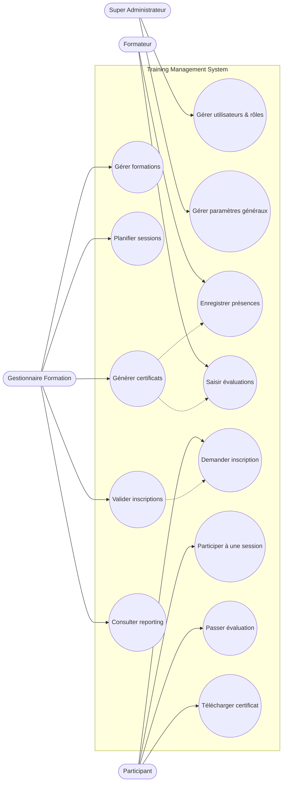
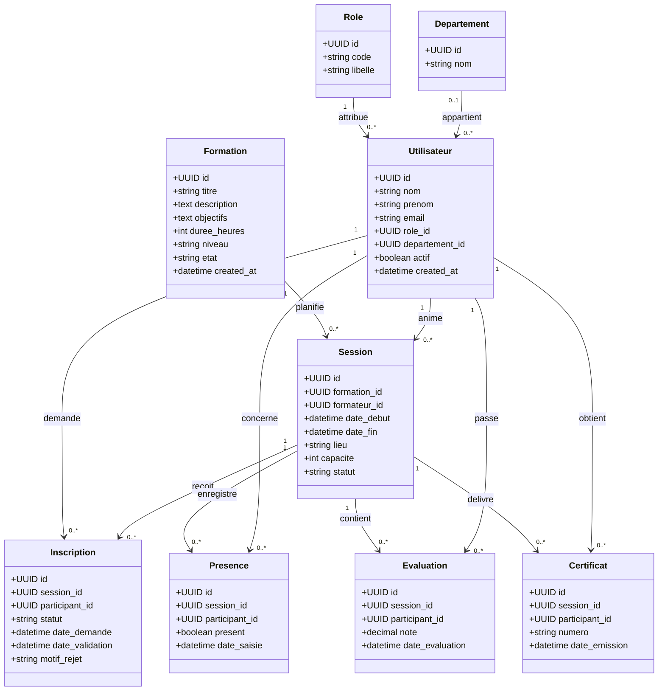
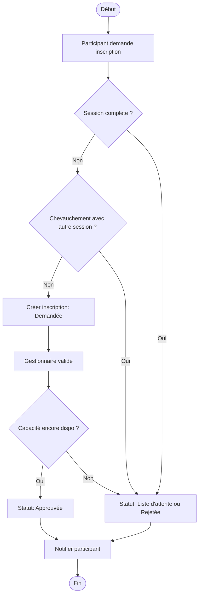
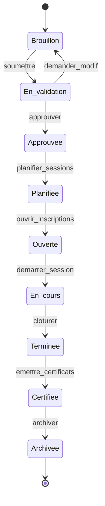
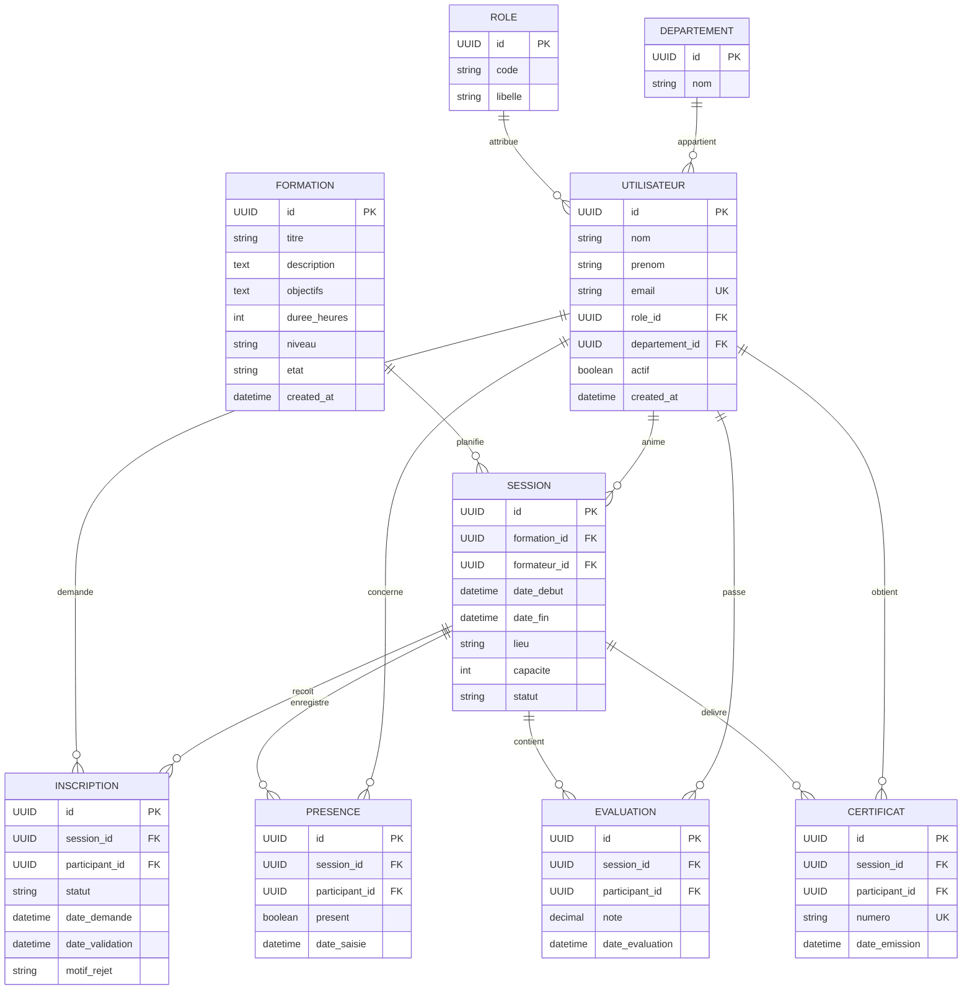

# UML & ERD — TMS (CNI)

## UML — Cas d’utilisation


## UML — Diagramme de classes


## UML — Diagramme de séquence (inscription + validation)
```mermaid
sequenceDiagram
  participant Participant
  participant UI
  participant Service
  participant Regles
  participant DB
  participant Gestionnaire
  participant Notification

  Participant->>UI: Demander inscription
  UI->>Service: createInscription(session_id, participant_id)
  Service->>Regles: verifierCapaciteEtChevauchement()
  Regles->>DB: lire sessions/inscriptions
  DB-->>Regles: donnees
  Regles-->>Service: OK | ListeAttente | Rejet
  Service->>DB: insert Inscription (Demandée)
  Service->>Notification: notifier gestionnaire + participant

  Gestionnaire->>UI: Valider inscription
  UI->>Service: validerInscription(inscription_id)
  Service->>Regles: reVerifierCapacite()
  Regles->>DB: lire inscriptions
  DB-->>Regles: donnees
  Regles-->>Service: OK | ListeAttente | Rejet
  Service->>DB: update Inscription
  Service->>Notification: notifier participant
```

## UML — Diagramme d’activité (processus d’inscription)


## UML — Diagramme d’états (cycle de vie formation)


## ERD — Diagramme détaillé


## Hypothèses et contraintes
- CERTIFICAT est lié à une SESSION (la formation est déduite via SESSION.formation_id).
- Unicité logique: UNIQUE(session_id, participant_id) pour INSCRIPTION, PRESENCE, EVALUATION, CERTIFICAT.
- EVALUATION.note dans [0, 20], certificat si présence >= 80% et note >= 10.
- Règles de chevauchement et capacité appliquées au niveau service.
